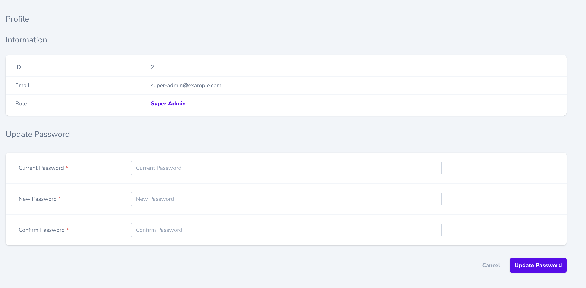

# laravel-nova-profile


## Introduction

This package provide a powerful tool designed to enrich the user experience by offering a comprehensive 'profile' section in Nova panel.
This feature not only displays the current user's data but also provides a seamless means to update their password, ensuring a secure and user-centric experience.

## Installation

1. Install using composer:
```sh
composer require dedecube/laravel-nova-profile
```

2. Register tool in NovaServiceProvider:

```php
public function tools()
{
    return [
        // ...
        new \Dedecube\Profile\Profile(),
    ];
}
```

1. Visit your nova at /profile.